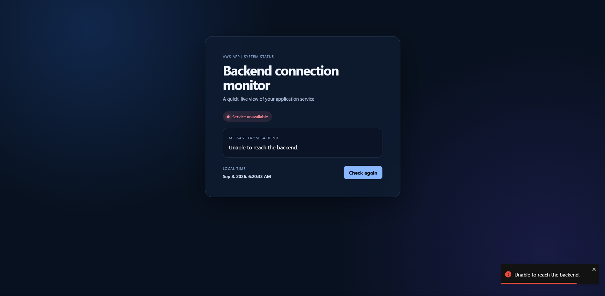

# AWS App Frontend



A small React-based status dashboard for checking connectivity with the AWS App backend. The interface requests a message from the backend, shows the service state, and displays the browser's local time.

## What it does

- Calls `GET /a2rp` when the page loads.
- Displays `Service online`, `Service unavailable`, or `Checking service`.
- Shows the backend message returned by the API.
- Provides a `Check again` action for a manual health check.
- Updates the local time once per second.
- Shows a toast notification when the backend request fails.

## Tech stack

- React 18
- Create React App (`react-scripts`)
- Axios for HTTP requests
- Sass CSS Modules for component styling
- React Toastify for error notifications

## Requirements

- Node.js and npm
- A running backend that exposes the `/api/v1/a2rp` endpoint

## Run locally

Install dependencies:

```bash
npm install
```

Start the development server:

```bash
npm start
```

The app opens at `http://localhost:3000`.

## API configuration

The frontend reads the API base URL from `REACT_APP_API_BASE_URL`. Create a `.env.local` file in the project root when you want to point the app at a specific backend:

```env
REACT_APP_API_BASE_URL=http://127.0.0.1:1198/api/v1
```

If the variable is not set, the current source fallback is:

- `http://127.0.0.1:1198/api/v1` on `localhost` and `127.0.0.1`
- `http://3.111.215.242:1198/api/v1` on other hostnames

The backend response is expected to include a boolean `success` field and, on success, a `message` field. Example:

```json
{
  "success": true,
  "message": "Backend is online"
}
```

For a production HTTPS site, configure an HTTPS API URL to avoid browser mixed-content blocking.

## Available scripts

| Command | Purpose |
| --- | --- |
| `npm start` | Run the development server |
| `npm run build` | Create an optimized production build in `build/` |
| `npm run winBuild` | Create a production build with source maps disabled on Windows |
| `npm test` | Run the Create React App test runner |

## Project structure

```text
public/                 Static HTML, manifest, and icons
src/App.js              Dashboard UI and backend request logic
src/index.js            React application entry point
src/index.css           Global styles and reset
src/styles.module.scss  Scoped component styles
package.json            Dependencies and npm scripts
```

## Build and deployment

Create the production bundle with:

```bash
npm run build
```

Deploy the generated `build/` directory to any static hosting service. Set `REACT_APP_API_BASE_URL` before building so the compiled frontend uses the intended backend URL. The backend must also allow requests from the frontend origin through CORS.

### GitHub Pages

This repository is configured for GitHub Pages deployment:

```bash
npm run deploy
```

The published site is `https://a2rp.github.io/aws-app1-frontend`. Configure the repository's Pages source as the `gh-pages` branch if GitHub has not enabled it automatically.

## Author

**Ashish Ranjan**  
Full-Stack Web Developer

## Links

- Portfolio: [https://www.ashishranjan.net](https://www.ashishranjan.net)
- GitHub: [https://github.com/a2rp](https://github.com/a2rp)
- CodePen: [https://codepen.io/ash1198](https://codepen.io/ash1198)
- LinkedIn: [https://www.linkedin.com/in/aashishranjan](https://www.linkedin.com/in/aashishranjan)
- Facebook: [https://www.facebook.com/theash.ashish/](https://www.facebook.com/theash.ashish/)
- YouTube: [https://www.youtube.com/@ashishranjan-ashz?sub_confirmation=1](https://www.youtube.com/@ashishranjan-ashz?sub_confirmation=1)
- Email: [ash.ranjan09@gmail.com](mailto:ash.ranjan09@gmail.com)

## Support

- Support: [https://a2rp-donation-page.netlify.app/](https://a2rp-donation-page.netlify.app/)
- Buy Me a Coffee: [https://buymeacoffee.com/a2rp](https://buymeacoffee.com/a2rp)
- Patreon: [https://www.patreon.com/a2rp](https://www.patreon.com/a2rp)
